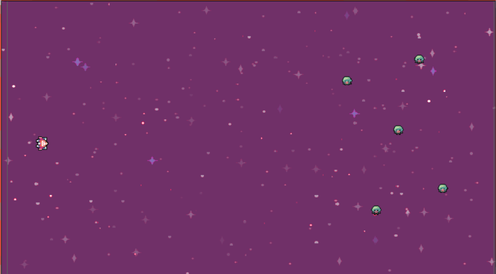
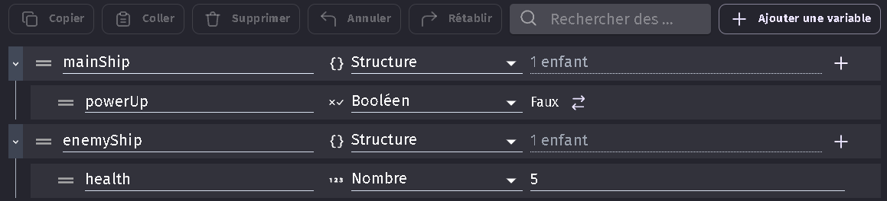

# Création des objets du jeu 🎮7

Maintenant que tu as GDevelop 5 prêt et configuré, il est temps de passer à la partie amusante : la création des objets de ton jeu ! Dans notre jeu Space Shooter, nous allons avoir besoin de plusieurs types d'objets : le vaisseau du joueur, les projectiles, les ennemis, les météores et les power-ups. Et devine quoi ? On va utiliser des super assets de "Space Shooter by Pixel Boy" pour tous ces objets. Allez, c'est parti !

1. **Importation des objets** : Pour importer les objets de "Space Shooter by Pixel Boy", il suffit de les glisser-déposer dans la fenêtre de GDevelop 5. Ils seront automatiquement ajoutés à ton projet. Tu peux ensuite les glisser-déposer dans ta scène pour les positionner. 🖱️

Voici les objets que tu dois positionner dans ta scène :

_SpaceBackgroud_ : Cet objet est un fond d'écran qui va servir de décor à notre jeu. il faut qu'il couvre toute la scène. 🌌

_Vaisseau du joueur_ : Glisse-dépose l'objet "PlayerShip" dans ta scène. Tu peux le positionner où tu veux, mais pour l'instant, place-le a gauche. Si tu clique sur l'objet, tu verras dans le paneau a gauche qu'il a une propriété "Angle" qui est réglée à 0. Change cette valeur pour la mettre à 90. Cela va faire en sorte que le vaisseau soit orienté vers la droite. 🚀

_Ennemi_ : Glisse-dépose l'objet "EnemyShip" dans ta scène. Tu peux le positionner où tu veux, mais pour l'instant, place-le a droite. 👾

Super, tu as positionné tous les objets de ta scène. Mais il reste encore quelques réglages à faire. Allez, on y retourne !

2. **Création des variables de scène** : Pour ce jeu, nous allons avoir besoin de plusieurs variables de scène. Ces variables vont nous aider à gérer le comportement de nos objets. Clique en haut à droite sur ouvrir les réglages, puis dans Modifier les variables de la scène. Clique sur le bouton "Ajouter une variable" et ajoute les variables suivantes :

**mainShip** : Cette variable est une structure qui a une sous-variable "powerUp" qui est un booléen. Cette variable va nous permettre de savoir si le vaisseau du joueur a un power-up ou non. 🛸

**enemyShip** : Cette variable est une structure qui a une sous-variable "health" qui est un nombre. Cette variable va nous permettre de savoir combien de points de vie il reste à l'ennemi. Régle la valeur de cette variable à 5. 💔

Et voilà, tu as de quoi commencer à jouer ! N'est-ce pas génial de voir ton jeu prendre forme ? Mais ne t'arrête pas là, il reste encore beaucoup à faire. Alors, prêt à programmer le comportement de ces objets ? Allez, c'est parti ! Direction [la prochaine partie](03_programmation_comportements.md) ! 🎉
