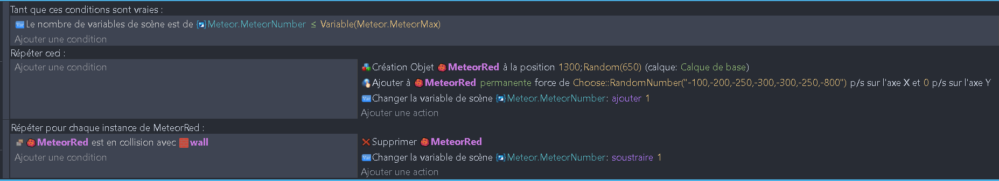
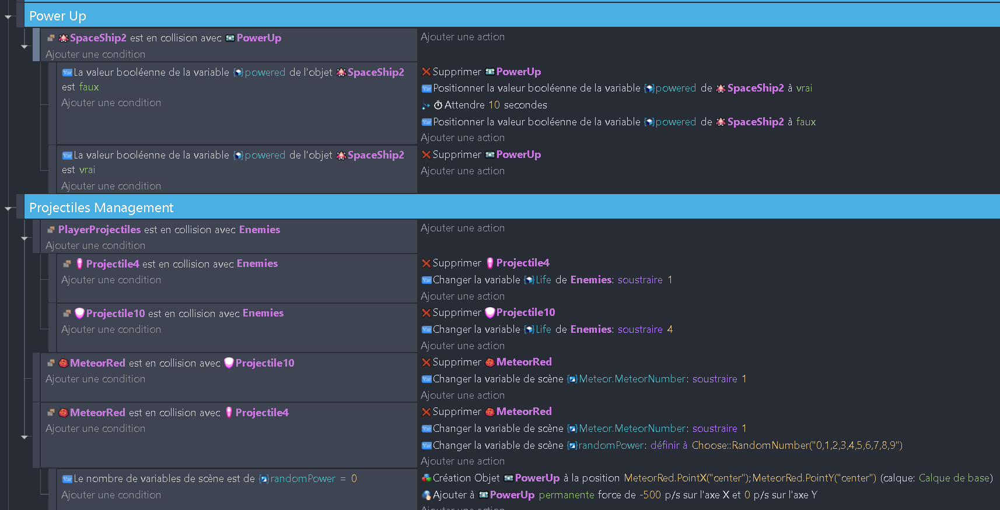

# Ajout des météores et des power-ups 🌠

## Ajout des météores

On va corser un peu les choses en ajoutant des météores qui vont venir de la droite de l'écran. Nous allons utiliser un outil plus complexe qu'une simple condition cette fois. Nous allons faire une boucle !

1. Ajoute une nouvelle structure dans les variables de scène. Nomme-la "meteor" et ajoute deux sous-variables "meteorMax" et "meteorNumber" qui sont des nombres. La première va nous permettre de définir le nombre maximum de météores qui peuvent être présents à l'écran et la deuxième va nous permettre de compter le nombre de météores présents à l'écran.

2. Ajoute une condition qui vérifie si le nombre de météores présents à l'écran est inférieur au nombre maximum de météores. Si c'est le cas, ajoute une action qui crée un objet "Meteor" à une position aléatoire sur l'axe Y et qui ajoute 1 à la variable "meteorNumber".

3. Ajoute un mur tout à gauche en dehors de la scène. Ajoute une condition qui vérifie si un météore est en collision avec ce mur. Si c'est le cas, ajoute une action qui supprime le météore et soustrait 1 à la variable "meteorNumber".

4. Ajoute une action qui applique une force aléatoire sur les météores pour qu'ils se déplacent vers la gauche.

Voici le résultat que tu devrais obtenir :

## Ajout des power-ups

Nous allons donner la possibilité au joueur de récupérer des power-ups qui vont lui donner des bonus. Nous allons utiliser la variable "powerUp" de "mainShip" dans les variables de scène.

1. Ajoute une condition qui vérifie si le vaisseau du joueur est en collision avec un power-up. Si c'est le cas, ajoute une action qui supprime le power-up et qui met la variable "powerUp" du vaisseau du joueur à true. Au bout de 10 secondes, ajoute une action qui met la variable "powerUp" du vaisseau du joueur à false.

2. Il va falloir modifier le comportement du vaisseau du joueur pour qu'il tire des projectiles plus puissants quand il a un power-up. Ajoute une condition qui vérifie si la variable "powerUp" du vaisseau du joueur est true. Si c'est le cas, ajoute une action qui tire "projectile10" à la place de "projectile4". Change aussi le "fireRate" à 0.1 au lieu de 0.3.

3. Il faut aussi rendre le "projectile10" plus puissant. Ajoute une condition qui vérifie si le "projectile10" est en collision avec un ennemi. Si c'est le cas, ajoute une action qui soustrait 4 à la variable "health" de l'ennemi et qui supprime le "projectile10", comme nous l'avons fait pour le "projectile4".

4. Enfin, nous allons conditionner l'apparition des power-ups. Quand un météore est détruit avec le "projectile4", change la valeur d'une variable "randomPower" avec une valeur aléatoire entre 0 et 9. Ensuite ajoute une condition qui vérifie si la variable "randomPower" est égale à 0. Si c'est le cas, ajoute une action qui crée un objet "powerUp" à la position du météore détruit et applique une force de -500 sur l'axe X pour qu'il fonce tout droit !

Voici le résultat que tu devrais obtenir :

Voilà, tu as fini cette partie ! N'hésite pas à tester ton jeu pour voir si tout fonctionne correctement. Si tu as des erreurs, n'hésite pas à comparer ton code avec celui de la solution. Tu peux ajouter un power-up dans la scène pour le prendre immédiatement pendant tes tests et vérifier que tout fonctionne correctement.

La fin ici : [Polissage et finalisation](05_polissage_finalisation.md) 🎉
