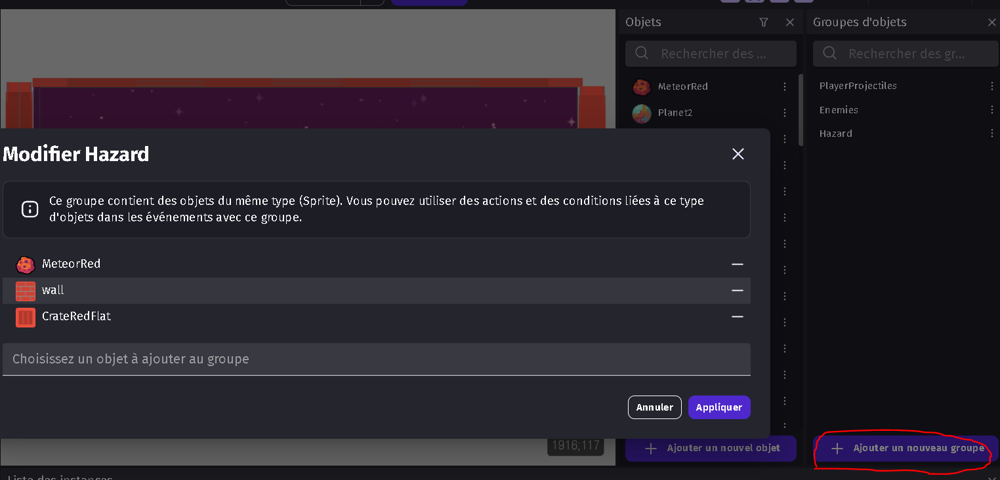
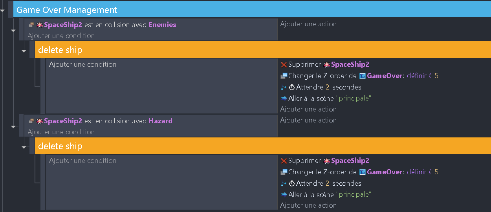

# Ajout des finitions 🎨

Tu as remarqué dans la dernière solution que je t'ai montré, j'ai rangé les bouts de code dans des groupes. C'est une bonne pratique pour organiser ton code et le rendre plus lisible. Tu peux ajouter des groupes en cliquant sur le bouton "Ajouter un groupe" dans la fenêtre des événements. Tu peux ensuite glisser-déposer les événements dans le groupe. Tu peux aussi ajouter des sous-groupes en cliquant sur le bouton "Ajouter un sous-groupe" dans la fenêtre des événements. Cela te permet de créer des groupes imbriqués.

Dans cette partie, je te propose de réorganiser ton code en groupes. Tu peux t'inspirer de la solution pour savoir comment organiser ton code.

# Game Over 🎮

Je te propose de regrouper certains éléments dans des groupes d'objets comme ceci par exemple :

Nous allons commencer par ajouter un écran de Game Over. Pour cela, nous allons créer un groupe qui va contenir tous les événements qui gèrent le Game Over. Nous allons ensuite ajouter une condition qui vérifie si le vaisseau du joueur est en collision avec un ennemi ou un météore. Si c'est le cas, nous allons afficher un texte "Game Over".

Ajoute des murs autour de la scène. Ajoute une condition qui vérifie si le vaisseau du joueur est en collision avec un mur. Si c'est le cas, ajoute une action qui supprime le vaisseau du joueur.

Ajoute dans la scène un objet "Texte" et positionne-le au centre de la scène et mets-le avec un index -1. Ajoute une condition qui vérifie si le vaisseau du joueur est en collision avec un ennemi ou un hazard (le groupe que nous venons de faire). Si c'est le cas, ajoute une action qui affiche le texte "Game Over" et qui met le texte index 2.

Au bout de 2 secondes, ajoute une action qui change la scène pour la scène "principale", ce qui relancera le jeu.

Voici le résultat que tu devrais obtenir :

Bravo ! Tu as fini ce projet ! Du moins la première partie car il reste tant de choses à faire pour rendre ce jeu plus intéressant. Je te laisse explorer par toi-même pour ajouter des fonctionnalités comme un score, des vies, des niveaux, des boss, etc...
Il faut aussi des sons et de la musique pour rendre le jeu plus vivant. Tu peux utiliser des sons et de la musique de ce site : https://freesound.org/
Et enfin quelques effets visuels comme des explosions, des particules, etc...

Tu peux essayer dès maintenant d'ajouter ces fonctionnalités à ton jeu. Mais nous allons avant tout ça voir comment publier ton jeu pour que tu puisses le partager avec tes amis ! C'est parti !

La suite ici : [Ajout de score](06_score.md) 🎉
