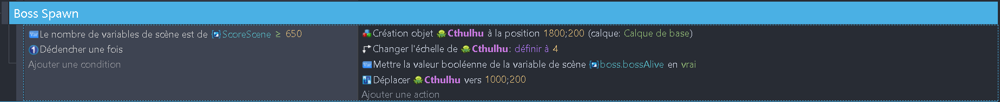
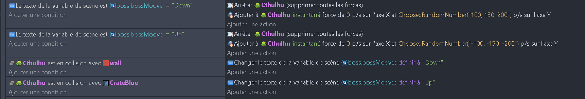
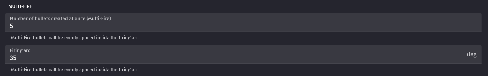
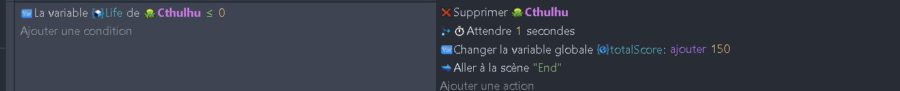
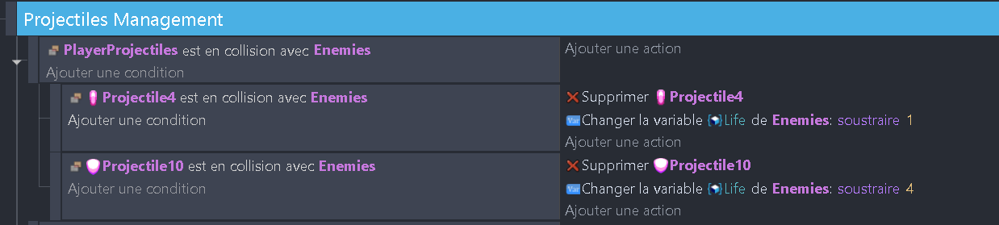
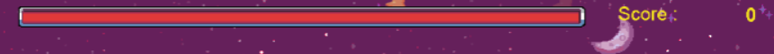
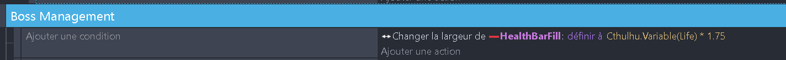

# Boss fin de niveau 🐙🎮

## Apprition du boss

Pour faire apparaître le boss, nous allons surveiller la variable totalScore. Si elle dépasse 600, le boss fera son entrée. N'oublie pas de l'agrandir pour qu'il soit plus impressionnant ! 📈

Il apparaît à droite et se déplace lentement vers la gauche. Une fois arrivé à destination, nous allons lui faire faire un mouvement de va-et-vient, de haut en bas, comme ceci :

## Tir du boss

Le boss va tirer des projectiles vers le joueur. Pour cela, nous allons ajouter le comportement fireBullet à l'objet boss. Il tirera ses projectiles toutes les 0.6 secondes avec un multi fire de 5 et un firing arc de 35°. 🎯

N'oublie pas de bien diriger le projectile vers le joueur et de faire en sorte qu'un projectile détruit le vaisseau du joueur. 💥

## Destruction du boss

On va attribuer une variable life au boss, comme pour les autres ennemis. On va lui mettre une valeur de 500 ! Ensuite, on va ajouter une condition qui vérifie si le boss est en collision avec un projectile. Si c'est le cas, on va décrémenter la variable life du boss. Si la variable life est inférieure ou égale à 0, on détruit le boss. 💔

Changeons le comportement des projectiles du joueur pour qu'ils affectent tous les ennemis et le boss. On peut les regrouper dans un groupe de scène, puis appliquer le comportement à ce groupe.

## Barre de vie du boss

On va ajouter une barre de vie au boss. Pour cela, on va ajouter 2 objets à notre scène :
EnergyBar et HealthBarFil.

HealthBarFil sera l'objet qui va représenter la vie du boss. On redefnini sa largeur pour qu'elle soit égale à la variable life du boss (avec un multiplicateur pour compenser la taille de la EnergyBar). N'hesite pas à ajuster le multiplicateur pour que la barre de vie soit bien visible sur toute la longueur de la bar. 📏

## Fin du niveau

Une fois le boss détruit, on va changer de scène pour passer à la scène suivante. On va aussi ajouter un écran de fin de niveau pour féliciter le joueur. 🏁

Je te laisse faire ça tout seul ! 🚀

## publication du jeu

La suite ici : [Publication du jeu](08_publication.md) 🎉
