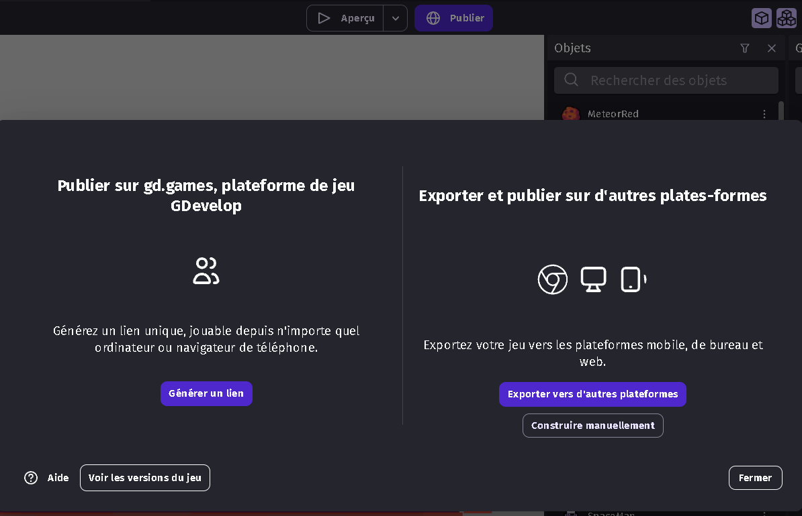

# Publication du jeu 🚀🎮

Pour publier ton jeu, c'est très simple. Il suffit d'appuyer sur le bouton "Publier" à côté d'"Aperçu" puis de choisir "Générer un lien". Ensuite, suis les instructions à l'écran et c'est fini ! 🎉

Tu peux aussi publier ton jeu sur la plateforme itch.io. C'est une plateforme qui permet de publier des jeux facilement et gratuitement. Tu peux créer un compte sur itch.io et ensuite tu peux publier ton jeu. Il suffit de créer un nouveau projet, de lui donner un nom et de choisir "HTML" comme type de projet. Ensuite, tu peux télécharger le fichier ZIP qui contient ton jeu et le décompresser. Tu peux ensuite publier le contenu de ce fichier sur itch.io. C'est aussi simple que ça ! 🌐

Voici le résultat final de ce projet : [CodeGaming Space Shooter](https://gd.games/alor_/codegaming-space-shooter)

Rendez-vous pour la suite de ce projet dans un futur atelier CodeGaming ! 📅

## Transfert du projet vers un autre ordinateur💻➡️💻

Si tu souhaites transférer ton projet vers un autre ordinateur, tu peux utiliser le format JSON. C'est un format de données qui est facile à lire et à écrire pour les humains, mais aussi facile à générer et à analyser pour les machines. Tu peux exporter ton projet en JSON en allant dans les dossiers de ton jeu. Tu peux ensuite importer ce fichier sur un autre ordinateur en choisissant "Ouvrir un projet" à côté de "Créer un projet". 📂

Voilà, tu as maintenant toutes les clés en main pour créer, développer et publier ton propre jeu. Amuse-toi bien et n'hésite pas à partager tes créations avec nous ! 🎉🎈

## pour aller plus loin 🚀

Tu peux aller plus loin en ajoutant des fonctionnalités à ton jeu. Voici quelques idées :

- Ajouter des vies au joueur 💖
- Ajouter un niveau supplémentaire avec un nouveau décor et de nouveaux ennemis ainsi qu'un nouveau boss 🌌👾
- Ajouter de nouvelles armes et des power-ups plus puissants 💥
- Ajouter un menu principal avec un bouton "Jouer" et un bouton "Quitter" 🎮

Tu as toutes les cartes en main pour créer ton propre jeu. Amuse-toi bien et n'hésite pas à partager tes créations avec nous ! 🎉🎈
