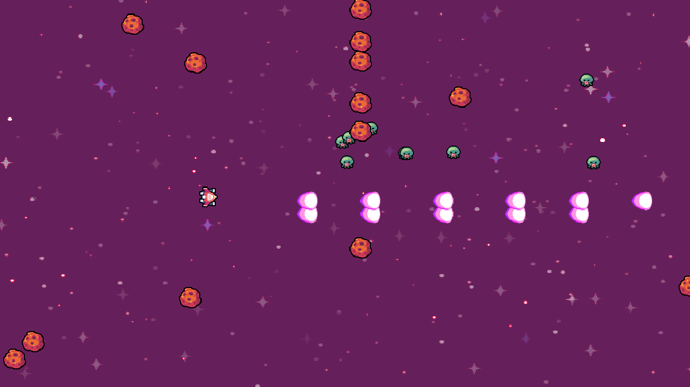

# Création d'un Space Shooter avec GDevelop 5 🚀

Salut les gamers ! 🎮 Prêt à plonger dans l'univers passionnant du développement de jeux ? Super, parce que nous avons un projet génial en réserve pour toi. Nous allons créer ensemble un jeu Space Shooter en utilisant GDevelop 5. Tu sais, ces jeux où tu contrôles un vaisseau spatial et tu dois détruire des tonnes d'ennemis tout en évitant des météores ? Oui, c'est ça ! 🌠

Mais attends, qu'est-ce que GDevelop 5 ? Eh bien, c'est un outil de développement de jeux super cool qui est à la fois gratuit et open-source. C'est parfait pour les débutants, mais assez puissant pour créer des jeux vraiment impressionnants. Et le meilleur dans tout ça ? Pas besoin d'être un as de la programmation pour l'utiliser. GDevelop 5 utilise un système d'événements visuels pour programmer les comportements dans ton jeu. C'est comme assembler des blocs de Lego ! 🧱

Alors, qu'est-ce que tu vas apprendre avec ce projet ? Un tas de choses ! Tu vas apprendre comment créer des objets de jeu, comment programmer leurs comportements, comment gérer les collisions, comment ajouter des effets sonores et visuels, et bien plus encore. Et à la fin, tu auras ton propre jeu Space Shooter à montrer à tes amis. Cool, non ? 😎

Alors, prêt à commencer cette aventure ? Attrape ton clavier, prépare-toi à coder et allons-y ! 💻

## Sommaire 📚

1. [Installation et configuration de GDevelop 5](instructions/01_preparation.md)
2. [Création du projet](instructions/02_creation_des_objets.md)
3. [Programmation des comportements](instructions/03_programmation_comportements.md)
4. [Ajout de la progression et de la difficulté](instructions/04_progression_difficulte.md)
5. [Polissage et finalisation](instructions/05_polissage_finalisation.md)
6. [Publication du jeu](instructions/06_publication.md)

## Résultat final 🏆

Tu peux voir le résultat final de ce projet **[ici](https://gd.games/alor_/codegaming-space-shooter)**.

Les règles sont simples :

- Détruis les ennemis et les météores, évite les météores et ramasse les power-ups. 💥
- Tu peux contrôler le vaisseau avec les flèches du clavier et tirer avec la barre d'espace. 🕹️
- Si tu sors de l'écran, c'est Game Over. 😵
- Si tu touches un météore, c'est Game Over. 🌑
- Si tu touches un ennemi, c'est Game Over. 👾

Bonne chance ! 🍀

